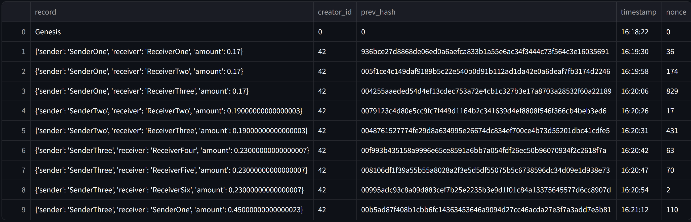
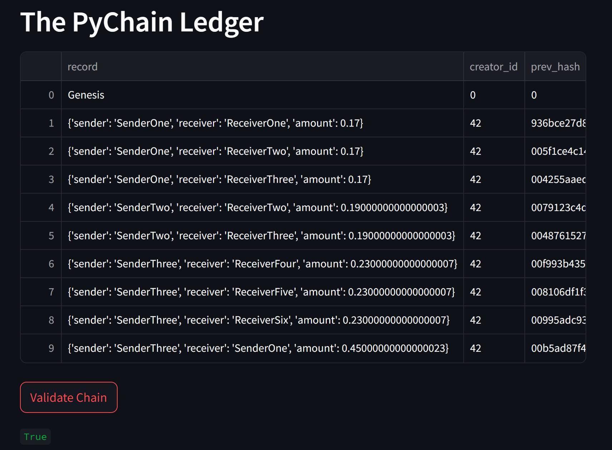

# Challenge 18
 

## The image above shows multiple transactions recorded on the chain/ledger  
 

  
## Screenshot When Validating Chain return true meaning transaction are being record as Expected